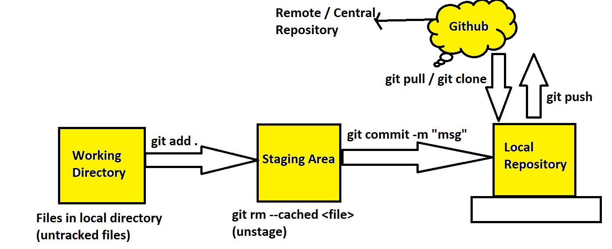

## `Why do we need Version Control?`
  * For collaboration
  * Storing Versions
  * Figuring out what happend
  * Backup

  ## `Issues without version control `
  * Once saved, all the changes made in the files are permanent and cannot be reverted back
  * No record of what was done and by whom
  * Downtime that can occur because of a faulty update could cost millions in losses 

  ## `Version Control :`
Version control systems (VCS) are tools that help track changes to files and manage versions over time. They are essential in software development and other fields where collaboration and revision history are crucial.
 *  Here are the types of version control systems:

    * Local Version Control Systems

    * Centralized Version Control Systems (CVCS)

    * Distributed Version Control Systems (DVCS)

## `Local Version Control Systems:`
 ### Description: 
Tracks file changes on a single computer. These systems are simple and store revisions locally.
## `How It Works: `
Changes are saved in a database or directory structure on the same machine.
## `Examples:`
Revision Control System (RCS)
Local backup scripts
 ## `Advantages:`
Simple and easy to set up.
Suitable for individuals.
 ## `Disadvantages:`
No collaboration features.
No remote backups (loss of data if the machine fails).

## `Centralized Version Control Systems (CVCS):`
`Description:` A single central server stores all the versioned files, and clients check out files from this server.

`How It Works:` Developers sync with a central server for commits, updates, and history.

`Examples:`
* Subversion (SVN)
 * Concurrent Versions System (CVS)
 * Perforce

`Advantages:`
* Easy to manage with a central repository.
* Simpler to enforce security and permissions.

`Disadvantages:`
 * Single point of failure (if the server crashes, all work stops).
* Limited offline capabilities.

 ## `Distributed Version Control Systems (DVCS):`
`Description:` Every developer has a full copy of the repository, including its history.

`How It Works:` Changes are committed locally and then pushed/pulled to/from other repositories when needed.

`Examples:`
 * Git
 * Mercurial
 * Bazaar
 * Fossil

`Advantages:`
 * Full repository backups are available on every developer's machine.
 * Enables offline work.
 * Faster operations since most actions are local.
 * Decentralized collaboration reduces risks.

`Disadvantages:`
 * Initial learning curve for new users.
 * Larger storage requirements (complete history on every machine).
  
## `What is Git ?`
  Git is a distributed version control system (VCS) that allows multiple developers to work on a project simultaneously without interfacing with each others changes.
  
  * It tracks changes in the source code during software development , allowing developers to revert to previous states, track changes and collaborate effectively .

  ### `History of GIT :`
  1973 : SCCM (Source Code Control System) 1 file
         RCM (Revision Control System) n files , 1 directory
         CVS (Concurrent Versions System) n files , n directories , 1 user
  
  2000 : SVN (Sub Version ) n files , n directories , n users

  2005 : GIT (Global Information Tracker)
  ### `Advantages of Git :`
  * It is Platform Independent
  * Free & Open Source 
  * ` Distributed Nature :` Every developers has a full copy of the entire repository , including the entire history of all the changes 
  * `Performance :` Git is designed to be fast , handling large projects effectively .

  ### `Understand GIT :`
  **Scenario :** Developing a website
  
  **1 . Start a Project :** Avinash and Anudeep are working together to develop a new website 
  
  2 . **Initial Setup :** Avinash creates the project's initial files and uses git to track these changes .
  
  3 . **Concurrent Work :** Anudeep adds a new feature while avinash fixes a bug , both using separate branches

  4 . **Merge Changes :** They merge their changes back into the main branch without losing each other's work

  5 . **History tracking and Revert :** They can revert to previous versions if any new changes introduce issues.

  ### `Commands :`
  * **which git :** It shows the whether the git is present or not
  * **yum install git :** To install git
  * **git init :** to initalize the git
  * **git --version :** it gives the version of the git
  * **git config --global user.name "Bhanu" :** to change username or to give username
  * **git config --global user.email "bhanu4bolligorla@gmail.com" :** to change email id or to give email id
  * **git config --global core.editor "vim" :** It takes vim editor defaultly to edit / modify the data in files
  * **git config --global help.autocorrect 1 :** It is set to auto correct
  * **git config --list :** It displays the what we have config
  * **git config --global --edit :** It edit / modify the configuring data 
             
      * all this config information is stored in git config in root user

## `Git Terminology :` 
### **Repository :** 
A Repository is a storage location where your project's code , files and history are kept
 * Repository can be local (on your computer) or remote (on a service like github)

## **Local Repository :** 
 * **Description :** A Local Repository is stored on your local machine .
   
   * It contains the project's files and the complete history of all changes .
* **Usage:** Used for development and testing before changes are shared with others

## **Central Repository:**
* **Description :** A Central Repository is a designated repository that serves as the main hub for collaboration.
  
  * It is authoritative source of truth for the project , where all the changes are eventually integrated.
* **Usage:** Typically used in centralized work flows where developers push their changes to  and pull updates frommthis central point.

## **Remote Repository:**
* **Description :** A Remote Repository is any repository that is not on your local machine .
  * It can be central repository or any other repository that you interact with over a network.

**Clone:**
    Cloning a repository means making a local copy of a remote repository on your computer.
    
  * This allows you to work on the project locally,make changes and later synchronize those changes back to the remote repository.

  **add :**  adding files means staging them for the next commit.

  * This tells git which files you want to include in your next snapshot of the repository.
  * The command git add <file> or git add . (to add all files) is used for this.

  **Commit:** Commiting is saving a snapshot your staged changes to the repository's history.

  * This creates a new revision of the project,which includes all the changes you;ve added.

  **Push:** Pushing means sending your committed changes from your local repository to a remote repository.

  * This updates the remote repository with your latest commits,allowing others to access your changes.  
### `Git Stages :`
 
 
 **Commands:**

*  **git log :** It displays the information about the history of commits
* **git log --oneline:** It displays the information about the history of commands and give first seven characters in the commit id
* **git show e718265 :** It displays the information about the specific commit.
* **git diff a6745bd..e71ca59 :** It displays the difference between those two commits
* **git log --oneline --author:** It displays the information about commits of specific developer 
* **git ignore :** It ignores the formats of the file.
    
      touch .gitignore : We need to store the data of extensions that what we need to ignore in this file 
* **git remote add origin https://github.com username/repository-name.git (add the github repository as a remote)**
 
  * **git remote:** This is the git command used to manage remote connections.

  * Remotes are versions of your project that are hosted on the internet or another network 

   * **add:** The add keyword is used to add a new remote connection to your local git repository
   * **Origin:** origin is a conventionally used name for the primary remote repository . you can name it anything , but origin is the default name most developers use.

 * **git push -u origin master:** to push the files from local repository to github
