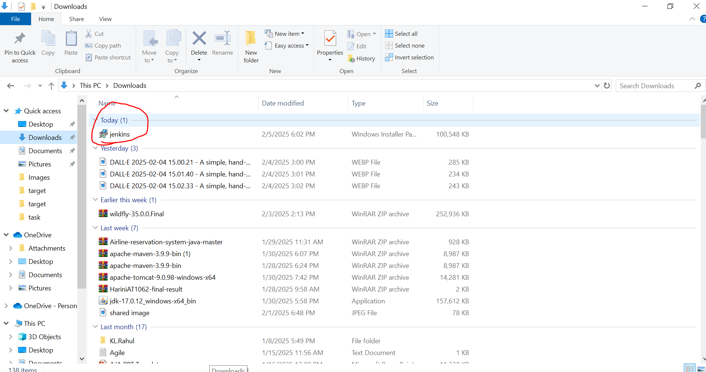
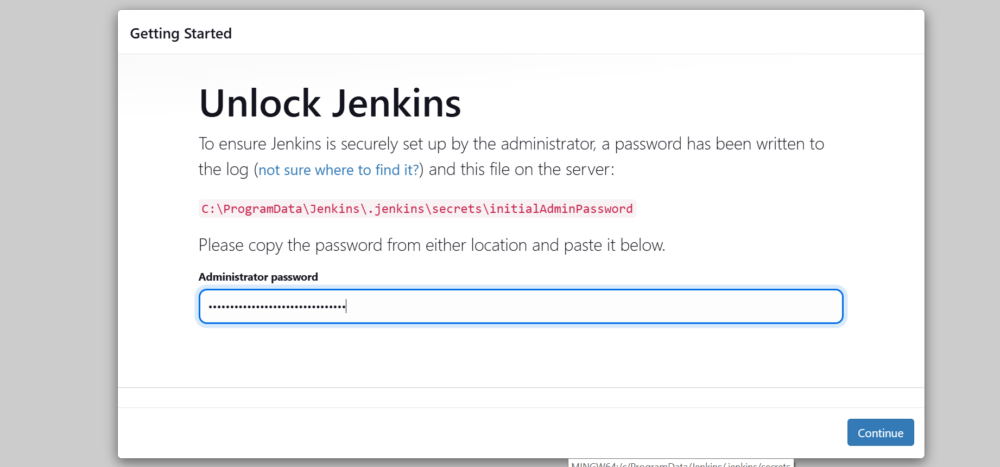
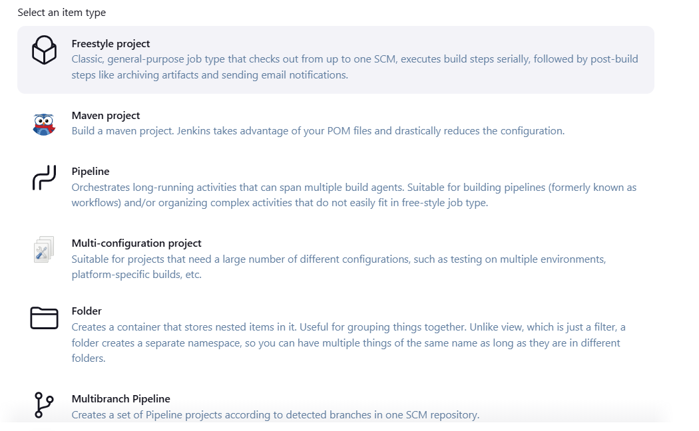
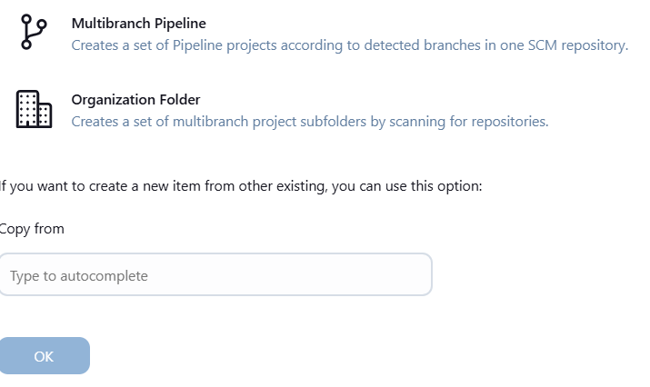

## What is Continuos Integration ?
 " It is the process of automating the building and testing of code, each time one of the team member commits changes of version control"
 
 

 * **CI** - Continuos Integration 
 * **CD** - Continuos Delivery / Deployment
 * First Delivery will come and then Deployment will come .

 ## Importance to Continuous Integration :

 * `Improves Quality:` Improves the quality by running multiple unit tests and analysing various static code.

 * `Increases Productivity :` Automating build of code saves a lot of time , there by increasing productivity .

 * `Reduces Risk :` Eliminate the risk of potential human errors by automating test.

## Popular Continuos Integration tools:

* **Gitlab CI**
* **Code Ship**
* **Bamboo**
* **Jenkins**
* **Team City**
* **Travis CI**
* For AWS Cloud , if we wanted to peform CI/CD, there are various services like code commit , code deploy , code guru , code build , code pipeline.

* In Azure cloud , If we want to perform CI/CD there are various services like Azure DevOps , Azure Boards, Azure Repos , Azure Pipelines,Azure testplans,Azure Artifacts.

## What is Jenkins ?
 A Continuous Integration Server which manages and control processes such as plan,code,build,test,deploy,operate,and monitor in DevOps Environment.

 

## Key features of Jenkins :

* Easy Installation Process 
* Upgrades are easily available
* Provides advance security
* Light weight container support
* Optimized performance
* Distributed team management

## Why Jenkins is so popular :

* Open Source
* Good Plugin support
* Good Community support
* Fast and Reliable
* Good OS Support
* Scripted Builds

### Topics:
 Following are the topics covered in this module :

 * Jenkins Architecture
 * Plugin Management in Jenkins
 * Notification in Jenkins
 * Jenkins Master slave architecture
 * Jenkins Delivery pipeline
 * Jenkins Declarative pipeline

 ## Jenkins Architecture : Source control management :

 

 ## Why do we need plugins ?
to have extra functionality

## plugin Management in Jenkins :

 
 Note : In Real time , we cannot install the plugin as simple as that , reason being they might be challanges with proxy settings as well as VPN.
 
 * In order to avoid this we should configure http proxy in jenkins pluggin of advanced tab.

## How to Install Jenkins on Windows :

### Different ways of Installation :

* Using Docker 
* Using Kubernetes
* Using Linux
* Mac Os
* Windows 
* Other Systems
* War Files
* Other Servlets
* Offline Installations

### Prerequisites :

* ### Minimum Hardware Equipments :

  * 256 MB of RAM
  * 1 GB of drive space ( Although 10 GB is a recommended minimum if running jenkins as a docker container)
* ### Recommended hardware configuration for a small team :

  * 4 GB + of RAM
  * 50 GB + of drive space

Note : Jenkins tool is developed on java code.

* A system running windows 10
* The latest copy of JDK or JRE
* Access to an account with administrator
* Internet

## Install Jenkins on Windows :

* Browse to the official jenkins download page 
   
      jenkins.io/downloads

* Under that downloading jenkins section is a list of installers for the long-term support (LTS) version of jenkins.

* Click on windows text under download jenkins , it will start downloading

* Once, you downloades the jenkins, then go for the path where you have downloaded you jenkins in your local machine.

* Double click on the file , which is of type windows installer package

* The setup wizard starts-click next to proceed.

* Select the install destination folder and click next to continue .

* Under the run service as alocal or domain user option, enter the domain username and password for the user account you want to run jenkins with click test ceredentials to verify the login data, then click next to proceed.

Note : go for the first option which is run service as local system .

* Enter the port number you want jenkins to run on. Click test port to check if the selected port is available then click next to continue .

Note : default port number of Jenkins is 8080

* Select the directory where java is installed on your system and click next to proceed.

* Select features you want to install with jenkins and click next to continue 

* Click install to start the installation process.

* Click finish after installing.

## How to configure the Jenkins :

After completing the installation process , you have to unblock jenkins before you can customize and start using it.

* In your web browser , navigate to the port number you selected during the installation using the following address .

`Syntax :` http://localhost:[portnumber]

     eg: http://localhost:8080

* Navigate to the location on your system specified by the unblock jenkins page

      C:\ProgramData\Jenkins\.jenkins\secrets\initialAdminPassword

 Where initial admin password is a file.

 * Open the initial admin password file using a text editor such as notepad etc..

 

 * Copy the password from the initial admin Password file

 

 * Paste the password in the administartor password feild on the unblock jenkins page and click continue to proceed.

 

## Custmize Jenkins:

* Click the install suggested plugins button to have jenkins automatically install the most frequently used plugins.

* After Jenkins finishes installing the plugins, enter the required information on the create first admin user page. click save and continue to proceed.

* On the Instance configuration page, confirm the port number you want jenkins to use and click save and finish to finish the initial customization.

* Click start using jenkins

* This is the dashboard you get after customizing jenkins :

## How to stop the server jenkins on windows ?

   search --> services --> jenkins --> stop

## How to restart the jenkins :
 2 ways 

 1. localhost:8080/safeRestart in jenkins url

 Jenkins will try to pause jobs and restart once all running jobs are either finished or paused.

 2. localhost:8080/Restart

 * go for safeRestart only.

## Plugin Installation :
  There are 2 ways to install the plugins.
     
1. Automatically
2. Manually

`1. Automatically :` Once you loogin into jenkins GUI left side you will see the option of mange jenkins 

*  Click on manage jenkins in 1ST tab , there is a system configuration , under that select plugins
* Next go to available plugins and search for the plugin which is required
* select the plugin under the list, once select the plugin, install button is highlated ,
* then click on install button.

`2. Manually :` Under plugins tab go for available plugins and search for the plugin and click on the plugin which is required.

* Once click on the plugin, new tab will open and click on releases
* Under releases you will see the various versions of the plugins.
* Go for the plugin which is required specific version.
* Under Installation option there is text called direct link.
* Once click on direct link , plugin will downloaded to our local machine.
* When we download plugin in manual way , again we need to deploy it to jenkins.
* In Jenkins , GUI plugins tab , click on advanced settings
* There you can search for the choose file button to upload which is downloaded to local machine.

## Plugins : 
   Add , remove , disable or enable pluginsthat can extend the functionality of jenkins.

* When we install plugin in automatic way, plugins extention is **JPI**  ( Jenkins Plugin)

* When we install plugin in manual way, plugin extention is **HPI** (Hudson Plugin)

## How to Uninstall the plugin ?
 manage jenkins --> plugins --> installed plugins --> search plugin name which we wanted to uninstall select the plugin and then  uninstall button will be highlated , once clicked on uninstall , plugin will get uninstalled.

 ## How to update the plugin ?
   manage jenkins --> plugins --> updated

* Select the plugin and then update button will be highlated, once clicked on update , plugin will get updated.
* In real time , we should not update the plugin directly, reason being they may be a challanges encounted
* It will be recommended to update the plugin in our local system where other team members will not affected if anything goes wrong.

## How to create the users ?
  manage jenkins --> security --> users

### Users : ( Create / delete / modify users that can log into this jenkins)

* Click on users, you will be seeing craete user option.
* Click on create user , fill all the details and then click on create user .

## How to give permission to the users ?
  manage jenkins --> Security ( Secure jenkins define who is arrowed to access / use the system)
  
  * Click on that security , you will go to authorization page.
  * Under that you will be seeing add user button
  * Click on that add user button
  * It will ask user ID and give userID and click ok button 
  * After that you should see added user name
  * Then give the permissionfor the users by checking the box (Minimun Access to give is overall Read)

  `Note :` By default , what ever we create the users, will get stored in Jenkin's own user database.
  
  * Jenkin's own user database is suitable for smaller setup where you have no existing user datadata use where.
  * Other option is **LDAP** ( Light Weight Directory Access Protocol)

  ## Authorization Stratergies :
   * By default you can see project-based matrix authorization stratergy , with this we can manage the authorization based on the options available under stratergy.
   
   Eg: Credentials , Agent, Job, Run etc ...

   ### Matrix  authorization stratergy :
It allows configuring the lowest level permisiion such as starting new build , configuring items or deleting them , individually.

## Jenkins projects ( Projects or jobs both are same )
  It is a combination of one or more tasks.

* Freestyle Project 
* Maven Project
* Pipeline
* Multi - Configuration Project
* Folder
* Multi branch pipeline
* Organization folder

These are default things we will get after creating the project.

**RBAC :** ( Role Based Access control ) one of the way where we can secure the jenkins

## How to create the job or project :
   In Jenkins GUI, you will see "+" new item on the left side 
   
   * Click on that new item , enter an item name then select an item type , once selected any of the item.
   * Click ok button which will be highlated 
   * Job configuration is consists of (Where we can give information / description about the project)
   * Source code management where will be passing url's of the repositories
   * Build triggers (In what way we wanted to trigger build that job), build environments , build step (where we can add tasks)
   * Post build action

## How to get free style job :
  new item -> give job name /  item name -> select free style project -> ok
 
 * Build steps (configuration) -> add build step dropdown --> select execute windows batch command --> type dir --> click on save

* then click on build now & check for console output.

## What if jenkins user forget the password ?
  * As the jenkins administrator there is a prevision to reset the user's credentails.

  manage jenkins --> security --> user's --> go for the user which need to be reset and click on security (left side you will see the option) 
  
  * see password and confirm password. There you can change the password and click on save .
  * Once as a administrator change the password again you need to inform to the user saying please , follow the below steps to login.
  * Once loged into the jenkins GUI , click on user name
  * Click on security -> their you can change the password.

**Note :**  Slaves, nodes , agents these three terminologies are same.
## Jenkins Folders :
   In windows o.s we can see all jenkins information and configuration under path 
       
    C:\ProgramData\Jenkins\.jenkins\workspace\demo>dir

* Under .jenkins folder we can see 
   
   * **Users :** where all the jenkins user data is available.
   * **Workspace:** where all the configured jobs information available.
   * **Secrets:** Where all the configured secrets are available 
   * **Plugins:** all the plugins (which are in installed manually and automating)available.
   * **Nodes:** where all the configured nodes are available
   * **Logs:** we can see slaves (if configured) and tasks logs are available.
   * Apart from the above folders there is jenkins configurational file namely **config.xml** (if at all changing config.xml file first take the backup of the file )
* We can also see the jenkins logs in GUI
   
   manage jenkins --> status information --> system log --> all jenkin logs

## Where we can see the jenkins version?
  We can see the jenkins version at the bottom of jenkins GUI and also
     
manage jenkins --> status information --> about jenkins

Ways to trigger the jenkins jobs :

**Triggers:** Setup automated actions that start your build based on specific events , like code changes or scheduled times.

* 5 ways :
   
   * **Trigger builds remotely (eg , from scripts) :** In order to use this option / trigger , first we need to generate the authentication token of the job.
   * Enable this option if you would like to trigger new builds by accessing a special pre-defined URL (Convenient for scripts)
   * You need to provide an authorization token in the form of string so that only those who know it would be able to remotely trigger this project's builds.
   * This is most useful when your jenkins instance grants read access to this job to anonymous users.
   * When that's not the case, jenkins will reject requests sent to the trigger URL even when the correct token is specified 
   * Use the following URL to trigger build remotely :

    JENKINS_URL/job/ajafreestyle/build?token=TOKEN_NAME or /buildWithParameters?token=TOKEN_NAME

**2 . Build after other projects are built (upstream and downstream jobs):** 

* setup a trigger so that when some other projects finish building, a new build is scheduled for this project.
* This is convenient for running on extensive test after a build is complete.
* We need to pass the job name (which are configured already  under projects to watch tab) 

* Under projects to watch , there are 4 options
 
 1. Trigger only if build is stable
 2. Trigger even if the build is unstable
 3. Trigger even if the build fails
 4. Always trigger , even if the build is aborted.
 
**3. Build periodically(in schedule):**
 
* This field follows the syntax of **CRON** (with minor differnces). Specifically, each line consists of 5 fields separated by TAB or whitespace.
 
   **MINUTE HOUR DOM MONTH DOW**
 
**Minute :** Minutes within the hour (0-59)
 
**Hour:** The Hour of the day (0-23)
 
**DOM:** The day of the month (1-31)
 
**Month:** The Month (1-12)
 
**DOW:** The day of the week (0-7) where 0 and 7 are sunday.
 
* To specify multiple values for one field, the following operation are available.
* For reference / Practice use this website
 
      crontab.guru
 
**4.Github hook trigger for GIT SCM Polling :**
 
  When jenkins receives a github push hook , Github plugin checks to see whether the hook came from a github repository  which matches the Git repository defined in SCM/Git section of this job.
 
**5.Poll SCM :** Configure jenkins to poll changes in SCM.
 
**Note:** We can also trigger the job in manually

### I Need to trigger on feb 8th saturday every minute and in every hour :

**Minute Hour DayofMonth Month DOW**
    
    * * 8 2 6

### Job configuration of build periodically trigger and poll SCM trigger :

* create new item --> triggers --> select check box build periodically or poll SCM --> once clicked on check box, scheduling comment box will be open up.
* There we need to give schedule as per requirement eg (* * 8 2 6) --> Save (check for the jobs whether running as per the schedule or not) 

### Build after projects are built :

* Create more than 1 jobs in triggers option select build after other projects are built.
* After selecting the option, need to give projects to watch name and then click on save and check.

  **Eg:** job1,job2,job3

* For job2 , put the upstream project as job1
* For job3 , put the upstream project as job2
* When we build the job1 , once job1 completed automatically downstream project has to be build.

* **For job2, once you select built after other projects are built, and then select sub option trigger even if the build falls and then save.**
* For job1, do one mistake wantedly and check for the all the jobs.

## Pipeline Project : 
  We are going for pipeline projects in order to secure the CI-CD pipeline code by storing in any of the repositories (github,gitlab,bigbucket) 

* Sample hello-world script creation :
   
   * Click on new item , select pipeline and click on ok.
   * Go for pipeline in configuration, where we can define pipeline script.
   * We can script in script tag or else we can take it from SCM.
   * In the script tag, click on drop-down option to try sample pipeline.

         pipeline{
          agent any
          stages{
            stage('hello'){
              steps{
                echo 'hello world'
              }
            }
          }
         }  

  * Click on save.
  * Make sure that stage view plugin should be installed, so that we can see stages.

### Rebuild VS Replay :

* When we use Rebuild , we are not changing anything, whereas Reply gives us prorision to change the code then and there.
* Replay , we also use it as one of the trouble-shooting mechanism.

* **If we do not know how to write pipeline script code, we can take the advantage of snippet generator in pipeline syntax option (pipeline syntax option will only visible when you create pipeline job or project.)** 
* The **Snippet generator** will help you learn the pipeline script code which can be used to define various steps.
* Pick a step you are interested in from the list, configure it, click generate pipeline script, and you will see a pipeline script statement that would call the step with that configuration.
* You may copy and paste the whole statement into your script , or pick up just the options you care about.

**Eg :** To print message

* In sample step of snippet generator , search for the echo, there is a step **echo:print message** then what message we need to print we have to pass it in message block then click on generate pipeline script, which will give us script to print message 
* By default pipeline execution will work on serially (one by one), if the previous stage is passed then only it will go for next or further stages. 
